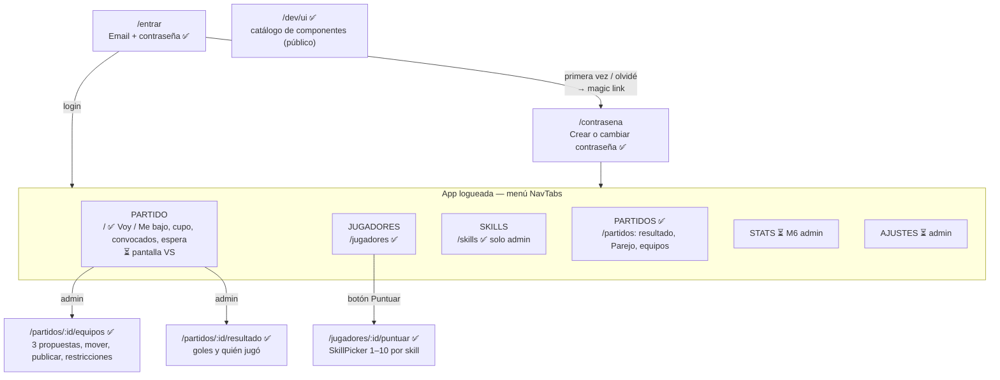
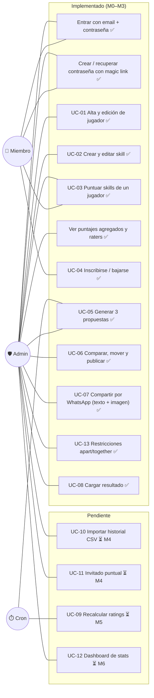
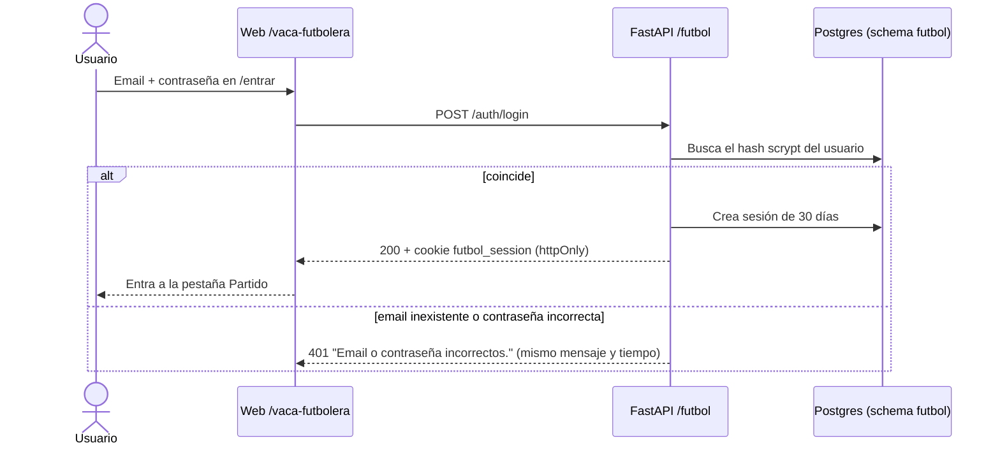
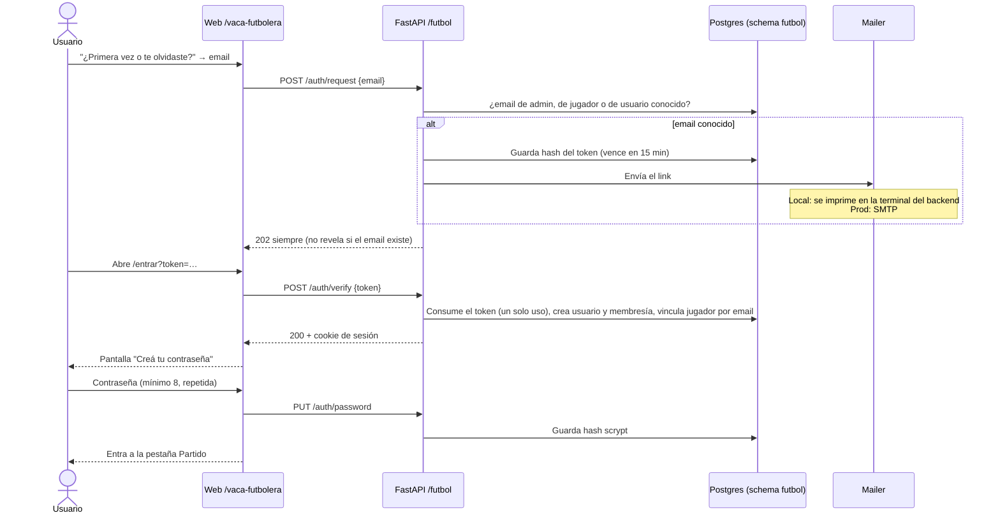
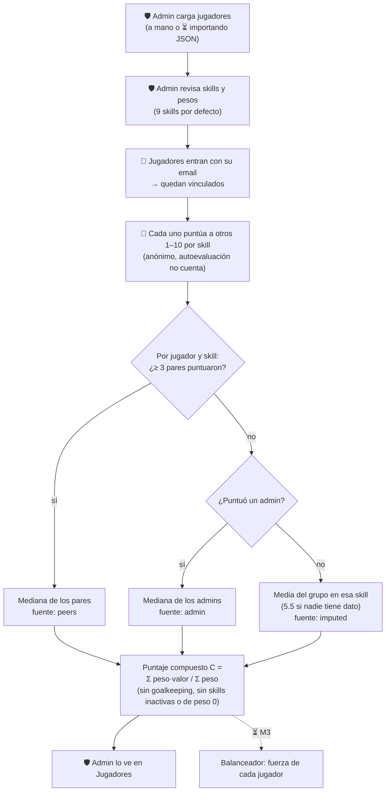
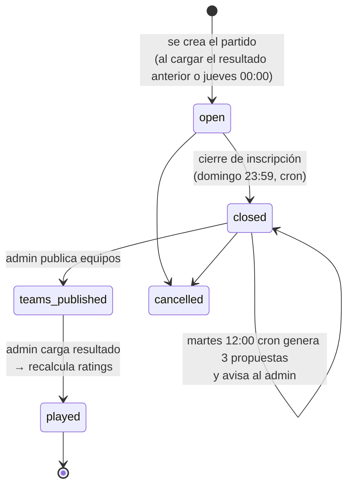

# Fútbol Vaquero — Procesos, vistas y casos de uso

Cómo funciona hoy la app (M0 + M1) y hacia dónde va (M2–M7). Complementa
[README.md](README.md) (estado y doc técnica) y [spec.md](spec.md) (spec funcional).

Leyenda en todos los diagramas: ✅ implementado · ⏳ pendiente.

---

## 1. Mapa de vistas y menú

Todas las rutas cuelgan de `/vaca-futbolera`.

| Pestaña | Miembro ve | Admin ve además |
|---|---|---|
| **Partido** ✅ | Fecha y hora, cuenta regresiva al cierre (roja si faltan < 12 h), **Voy / Me bajo**, convocados `n/cupo`, lista de espera. ⏳ pantalla VS | Agregar y sacar jugadores (también después del cierre). ⏳ armar equipos, cargar resultado |
| **Jugadores** ✅ | Lista con puesto y botón **Puntuar** (si su usuario está vinculado a un jugador) | Formulario **Agregar jugador**, puntaje compuesto y raters por skill |
| **Skills** ✅ | — (la pestaña no aparece y la URL redirige) | Crear skill, cambiar peso 0–3, activar o desactivar |
| **Partidos** ✅ | Tarjeta por partido jugado: BLANCOS 5 – 4 NEGROS, "Parejo" si la diferencia ≤ 2, desplegable con quién jugó | Editar resultado |
| Stats ⏳ | — | Parejidad y calibración |
| Ajustes ⏳ | — | Calendario, cupo, pesos, restricciones |

CAMBIO: la pestaña de contraseña y salir deberian estar en la esquina, el logo de la vaca que esta aca: static/lavaca.png deberia ir ene l medio, pero dentro de .random(logo)
---

## 2. Casos de uso

---

## 3. Historias de usuario

| # | Historia | Criterio de aceptación | Estado |
|---|---|---|---|
| HU-01 | Como **miembro**, quiero entrar con email y contraseña, sin depender de abrir un mail cada vez. | Login con contraseña; sesión de 30 días; mismo error si el email o la contraseña están mal. | ✅ |
| HU-01b | Como **miembro nuevo**, quiero crear mi contraseña la primera vez con un link por email, y recuperarla igual si me la olvido. | El link vale 15 min y se usa una vez; lleva a crear la contraseña (mínimo 8 caracteres); sin contraseña no se puede usar la app. | ✅ |
| HU-02 | Como **admin**, quiero cargar a los jugadores con su puesto y email, para que puedan entrar y ser puntuados. | El jugador aparece en la lista; al entrar con ese email queda vinculado. | ✅ |
| HU-03 | Como **admin**, quiero crear una skill nueva, para medir algo que hoy no se mide. | Aparece en el formulario de puntuar de todos; sin puntajes no cambia el orden de los jugadores. | ✅ |
| HU-04 | Como **admin**, quiero desactivar una skill en vez de borrarla, para no romper el historial. | Deja de verse y de contar; se puede reactivar. | ✅ |
| HU-05 | Como **miembro**, quiero puntuar a mis compañeros de forma anónima, para opinar sin conflictos. | Solo veo los valores que puse yo; nadie ve quién puntuó qué. | ✅ |
| HU-06 | Como **miembro**, quiero puntuarme a mí mismo, sabiendo que no cuenta. | Se guarda, pero no entra en el puntaje del grupo. | ✅ |
| HU-07 | Como **admin**, quiero ver el puntaje de cada jugador y de dónde sale, para confiar en el número. | Veo el compuesto y, por skill: valor, cantidad de raters y fuente (peers/admin/imputed). | ✅ |
| HU-08 | Como **admin**, quiero cargar el plantel inicial de una vez desde un archivo, para no hacerlo a mano. | Importar el JSON crea los jugadores con sus puntajes de admin. | ⏳ próximo |
| HU-09 | Como **miembro**, quiero anotarme o bajarme del partido del miércoles desde el celular. | Con cupo lleno quedo en lista de espera; si alguien se baja, subo solo. Después del cierre no puedo anotarme, pero sí bajarme (queda marcado). | ✅ |
| HU-10 | Como **admin**, quiero que el sistema me proponga equipos parejos, para armarlos en menos de 2 minutos. | 3 propuestas con % de victoria y desglose del costo; puedo mover jugadores y publicar. | ✅ |
| HU-11 | Como **miembro**, quiero ver los equipos publicados en una pantalla VS y recibirlos por WhatsApp. | Tarjeta Blancos vs Negros en la pestaña Partido; copiar o compartir imagen; texto con formato de la spec §7. | ✅ |
| HU-12 | Como **admin**, quiero cargar el resultado y quién jugó realmente. | El partido pasa a `played`, abre la inscripción del siguiente y aparece en Partidos. | ✅ (recalcular ratings: ⏳ M5) |
| HU-13 | Como **miembro**, quiero ver los partidos jugados con su resultado y quién jugó en cada equipo. | Pestaña Partidos con tarjetas, "Parejo" y desplegable de equipos. | ✅ |

---

## 4. Proceso: login ✅

**Accesos habituales: email + contraseña**

**Primer acceso u olvido de contraseña: magic link**

---

## 5. Proceso: del plantel al puntaje ✅

---

## 6. Proceso: ciclo semanal del partido (✅ M2: open → closed · ⏳ M3–M5)

Estados de `matches.status`, según la spec §3 y §5:

Reglas de inscripción (M2): cupo por defecto 16. Los que llegan con el cupo lleno van a la lista de
espera por orden de llegada. Si alguien se baja después del cierre, sube el primero de la espera, la
baja queda marcada `late_withdrawal` y, si ya había propuestas, se regeneran.
