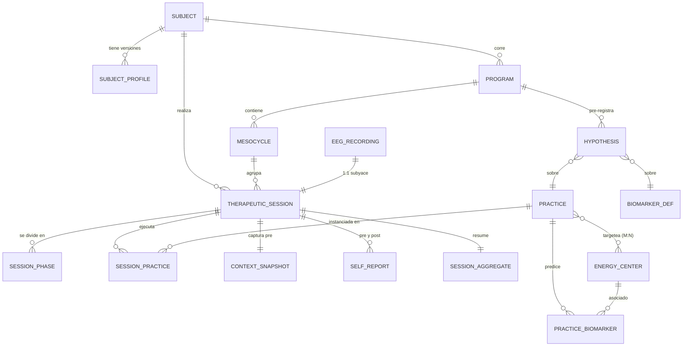

# Arquitectura de Datos — Protocolo de Centros Energéticos

> Documento 2 de la serie. Depende del Master Spec.
> Alcance: modelo de datos, entidades, relaciones, DDL Postgres, measurements InfluxDB,
> modelos Python, capa de servicios/funciones, y flujo de datos de una sesión.
> HRV/coherencia cardíaca integrado desde el diseño (no como fase tardía).
> Stack objetivo: FastAPI + asyncpg/psycopg2 (patrón dual existente) + InfluxDB + React/Zustand.

---

## 0. Principios de diseño (heredados del Master Spec)

1. **Tres capas ontológicas, tres fuentes de verdad, una que decide.** Simbólico = etiquetas/features. Objetivo (EEG + HRV) = verdad de terreno. Auto-reporte = fenomenología. En el schema esto se traduce en que las features simbólicas viven en columnas `JSONB` etiquetadas, nunca mezcladas con las métricas.
2. **Hot vs cold storage.** Per-window (EEG raw, band power, RR intervals, métricas por ventana) → InfluxDB (retention 30d). Agregados por-sesión que queremos para siempre → Postgres. Regla ya establecida en el doc per-channel; la extendemos a HRV.
3. **Backward-compat.** No rompemos `eeg_recordings`. Las sesiones terapéuticas *referencian* un recording existente 1:1 y agregan su capa. Sesiones viejas siguen leyéndose.
4. **Todo agregado nuevo es nullable + versionado.** `schema_version` por entidad para migraciones incrementales.
5. **Reglas legibles antes que modelos opacos.** El motor de recomendación es data-driven pero trazable.

---

## 1. Vista de arquitectura (flujo)

```
                          ┌──────────────────────────────────────────┐
                          │              FRONTEND (React)             │
                          │  /lab/brain · SessionOrchestrator UI      │
                          │  AdaRealtimePanel · SelfReport forms      │
                          │  Zustand: brainStore, adaRealtimeStore,   │
                          │           sessionStore (NUEVO)            │
                          └───────────────┬──────────────────────────┘
                                          │ WS + REST
                          ┌───────────────▼──────────────────────────┐
                          │            BACKEND (FastAPI)              │
                          │                                           │
   Muse 2 (BLE) ──LSL──►  │  EEGIngest ──► Processing (Welch/canal) ──┼──► InfluxDB
   Polar H10 (BLE) ─────► │  HRVIngest ──► HRVProcessor (RR→métricas)─┼──►  (hot 30d)
                          │                                           │    · eeg_sample
                          │  SessionOrchestrator (state machine)      │    · eeg_metrics
                          │  RecommendationEngine (perfil→práctica)   │    · eeg_band_power
                          │  AggregationService (cierre de sesión) ───┼──► Postgres
                          │  AnalysisService (ADA deep/LLM)           │    (cold ∞)
                          │  CosmologyService · ChronobiologyService  │    · subjects…
                          └───────────────────────────────────────────┘
```

Dos ingestas paralelas (EEG y HRV), un orquestador de sesión que las coordina en fases, y un `AggregationService` que al cerrar la sesión promueve los agregados a Postgres.

---

## 2. Modelo de dominio — las tres capas del perfil

Antes del schema, el mapa conceptual de qué es cada cosa.

### 2.1 Perfil INTRÍNSECO (estable, cambia rara vez → versionado)
Lo que define al sujeto de base. Se carga una vez, se re-versiona si cambia algo estructural.
- **Identidad biológica:** fecha/hora/lugar de nacimiento, sexo, cronotipo.
- **Línea de base neurofisiológica:** IAF (individual alpha frequency), baselines EEG históricos (α/θ/coh de reposo promediados), HRV de reposo (RMSSD/SDNN basal).
- **Línea de base psicológica:** auto-reporte inicial extendido (una vez): historia, centros percibidos como bloqueados, objetivos terapéuticos, rasgos.
- **Capa simbólica intrínseca:** carta natal (features derivadas: sol/luna/ascendente, elementos, modalidades) — guardada como `JSONB`, etiquetada `symbolic`.

### 2.2 Perfil EXTRÍNSECO (dinámico, snapshot por sesión)
El estado del sujeto y su contexto *en el momento de cada sesión*.
- **Cronobiológico (base fisiológica):** hora del día, minutos desde el despertar (ventana CAR), cronotipo aplicado.
- **Fisiológico reciente:** sueño (h + calidad), ejercicio, última comida, cafeína/alcohol/sustancias, ciclo hormonal.
- **Estado vital:** estrés percibido, carga, ánimo basal, eventos.
- **Simbólico extrínseco:** fase lunar, estación, hora planetaria, tránsitos — `JSONB` etiquetado `symbolic`.

### 2.3 Capa SIMBÓLICA (transversal)
Los centros energéticos, prácticas, tradiciones, intención. Vive en tablas de catálogo (centros, prácticas) + campos por sesión (intención, centro target).

---

## 3. Diagrama entidad-relación



Claves de diseño de las relaciones:
- **`THERAPEUTIC_SESSION 1:1 EEG_RECORDING`** — reuso el recorder existente; la sesión terapéutica es una "cara" adicional del recording, no un duplicado.
- **`PRACTICE M:N ENERGY_CENTER`** — una práctica (ej. blessing de Dispenza) toca varios centros; un centro tiene varias prácticas.
- **`PRACTICE_BIOMARKER`** — la tabla que codifica las *hipótesis* biomarcador↔práctica↔centro (el corazón de la falsabilidad).
- **`HYPOTHESIS`** — pre-registro por programa: qué esperamos, sobre qué práctica y biomarcador, antes de mirar datos.

---

## 4. Postgres — DDL (cold storage, permanente)

Convención: `snake_case`, `id BIGSERIAL PK`, timestamps `TIMESTAMPTZ`, features simbólicas en `JSONB`, todo lo nuevo nullable.

### 4.1 Sujeto y perfil

```sql
CREATE TABLE subjects (
    id              BIGSERIAL PRIMARY KEY,
    handle          TEXT UNIQUE NOT NULL,           -- 'pedro'
    display_name    TEXT,
    created_at      TIMESTAMPTZ NOT NULL DEFAULT now()
);

-- Perfil intrínseco versionado (append-only; el activo es el de mayor version)
CREATE TABLE subject_profiles (
    id                  BIGSERIAL PRIMARY KEY,
    subject_id          BIGINT NOT NULL REFERENCES subjects(id),
    version             INTEGER NOT NULL,
    is_active           BOOLEAN NOT NULL DEFAULT true,

    -- identidad biológica
    birth_datetime      TIMESTAMPTZ,               -- fecha + HORA de nacimiento
    birth_lat           DOUBLE PRECISION,
    birth_lon           DOUBLE PRECISION,
    birth_tz            TEXT,
    sex                 TEXT,
    chronotype          TEXT,                       -- 'morning'|'evening'|'intermediate'

    -- baseline neurofisiológico (se recalcula tras la semana de calibración)
    iaf_hz              DOUBLE PRECISION,           -- individual alpha frequency
    baseline_alpha      DOUBLE PRECISION,
    baseline_theta      DOUBLE PRECISION,
    baseline_coherence  DOUBLE PRECISION,
    baseline_faa        DOUBLE PRECISION,
    baseline_rmssd      DOUBLE PRECISION,           -- HRV reposo
    baseline_sdnn       DOUBLE PRECISION,
    baseline_updated_at TIMESTAMPTZ,

    -- capa psicológica y simbólica (etiquetadas, no causales)
    psych_baseline      JSONB,                      -- {history, blocked_centers[], goals[]}
    natal_chart         JSONB,                      -- {sun, moon, asc, elements{}, ...} SYMBOLIC

    schema_version      INTEGER NOT NULL DEFAULT 1,
    created_at          TIMESTAMPTZ NOT NULL DEFAULT now(),
    UNIQUE (subject_id, version)
);
CREATE INDEX idx_profiles_active ON subject_profiles(subject_id) WHERE is_active;
```

### 4.2 Catálogos simbólicos (centros y prácticas)

```sql
CREATE TABLE energy_centers (
    id              SMALLINT PRIMARY KEY,           -- 1..7 (raíz..coronilla)
    slug            TEXT UNIQUE NOT NULL,           -- 'root','sacral',...,'crown'
    sanskrit        TEXT,                           -- 'muladhara',...
    element         TEXT,                           -- tattva SYMBOLIC
    bija_mantra     TEXT,                           -- 'LAM',...
    psych_theme     TEXT,                           -- 'seguridad/arraigo'
    symbolic_meta   JSONB                           -- glándula/plexo/color, todo SYMBOLIC
);

CREATE TABLE practices (
    id              BIGSERIAL PRIMARY KEY,
    slug            TEXT UNIQUE NOT NULL,           -- 'dispenza_blessing','kapalabhati',...
    name            TEXT NOT NULL,
    tradition       TEXT NOT NULL,                  -- 'dispenza'|'pranayama'|'reiki'|'mantra'|'meditation'
    description     TEXT,
    default_params  JSONB,                          -- {duration_s, breath_rate, mantra, ...}
    phase_template  JSONB,                          -- secuencia de states para el orquestador
    schema_version  INTEGER NOT NULL DEFAULT 1,
    created_at      TIMESTAMPTZ NOT NULL DEFAULT now()
);

-- M:N práctica ↔ centro
CREATE TABLE practice_centers (
    practice_id     BIGINT REFERENCES practices(id),
    center_id       SMALLINT REFERENCES energy_centers(id),
    is_primary      BOOLEAN NOT NULL DEFAULT false,
    PRIMARY KEY (practice_id, center_id)
);

-- Definición canónica de biomarcadores (para tipar hipótesis y agregados)
CREATE TABLE biomarker_defs (
    id              BIGSERIAL PRIMARY KEY,
    slug            TEXT UNIQUE NOT NULL,           -- 'theta_fm','coh_global','faa','hrv_coherence','rmssd'
    name            TEXT NOT NULL,
    modality        TEXT NOT NULL,                  -- 'eeg'|'hrv'
    unit            TEXT,
    measurement_strength TEXT,                      -- 'direct'|'proxy'|'weak'|'requires_hrv'
    caveat          TEXT                            -- el disclaimer que va a la UI
);

-- Hipótesis biomarcador↔práctica↔centro (la tabla de falsabilidad)
CREATE TABLE practice_biomarkers (
    id              BIGSERIAL PRIMARY KEY,
    practice_id     BIGINT REFERENCES practices(id),
    center_id       SMALLINT REFERENCES energy_centers(id),
    biomarker_id    BIGINT REFERENCES biomarker_defs(id),
    expected_dir    SMALLINT NOT NULL,             -- +1 sube, -1 baja, 0 modula
    confidence      TEXT NOT NULL DEFAULT 'hypothesis'  -- 'hypothesis'|'supported'|'refuted'
);
```

### 4.3 Programa longitudinal

```sql
CREATE TABLE programs (
    id              BIGSERIAL PRIMARY KEY,
    subject_id      BIGINT NOT NULL REFERENCES subjects(id),
    title           TEXT NOT NULL,                  -- '3 meses — recorrido de centros'
    started_at      TIMESTAMPTZ NOT NULL DEFAULT now(),
    ends_at         TIMESTAMPTZ,
    status          TEXT NOT NULL DEFAULT 'calibration', -- calibration|active|closed
    goals           JSONB,                          -- objetivos por centro
    created_at      TIMESTAMPTZ NOT NULL DEFAULT now()
);

CREATE TABLE mesocycles (
    id              BIGSERIAL PRIMARY KEY,
    program_id      BIGINT NOT NULL REFERENCES programs(id),
    idx             SMALLINT NOT NULL,              -- 0=calibración,1,2,3
    title           TEXT,                           -- 'Fundamento / centros bajos'
    focus_centers   SMALLINT[],                     -- {1,3}
    starts_on       DATE,
    ends_on         DATE,
    UNIQUE (program_id, idx)
);

-- Pre-registro de hipótesis (declaradas ANTES de mirar datos)
CREATE TABLE hypotheses (
    id              BIGSERIAL PRIMARY KEY,
    program_id      BIGINT NOT NULL REFERENCES programs(id),
    practice_id     BIGINT REFERENCES practices(id),
    biomarker_id    BIGINT REFERENCES biomarker_defs(id),
    statement       TEXT NOT NULL,                  -- texto legible de la predicción
    expected_dir    SMALLINT NOT NULL,
    threshold_sigma DOUBLE PRECISION DEFAULT 2.0,   -- umbral de "cambio real"
    registered_at   TIMESTAMPTZ NOT NULL DEFAULT now(),
    verdict         TEXT DEFAULT 'open',            -- open|supported|refuted|inconclusive
    verdict_at      TIMESTAMPTZ
);
```

### 4.4 Sesión terapéutica (el corazón)

```sql
-- 1:1 con eeg_recordings existente. La sesión terapéutica es la capa de arriba.
CREATE TABLE therapeutic_sessions (
    id              BIGSERIAL PRIMARY KEY,
    recording_id    BIGINT UNIQUE REFERENCES eeg_recordings(id),  -- reuso del recorder
    subject_id      BIGINT NOT NULL REFERENCES subjects(id),
    program_id      BIGINT REFERENCES programs(id),
    mesocycle_id    BIGINT REFERENCES mesocycles(id),

    intention       TEXT,                           -- "trabajo el corazón porque..."
    target_center   SMALLINT REFERENCES energy_centers(id),
    quality         TEXT NOT NULL DEFAULT 'pending', -- pending|valid|low  (gates §7.4 master)
    hrv_available   BOOLEAN NOT NULL DEFAULT false,  -- hubo Polar conectado

    started_at      TIMESTAMPTZ NOT NULL DEFAULT now(),
    ended_at        TIMESTAMPTZ,
    schema_version  INTEGER NOT NULL DEFAULT 1
);
CREATE INDEX idx_ts_subject_time ON therapeutic_sessions(subject_id, started_at);

-- Prácticas ejecutadas en la sesión (una sesión puede encadenar varias)
CREATE TABLE session_practices (
    id              BIGSERIAL PRIMARY KEY,
    session_id      BIGINT NOT NULL REFERENCES therapeutic_sessions(id),
    practice_id     BIGINT NOT NULL REFERENCES practices(id),
    ordinal         SMALLINT NOT NULL DEFAULT 0,
    params          JSONB,                          -- override de default_params
    started_at      TIMESTAMPTZ,
    ended_at        TIMESTAMPTZ
);

-- Fases de la máquina de estados, con time-range (para pivotear Influx por state)
CREATE TABLE session_phases (
    id              BIGSERIAL PRIMARY KEY,
    session_id      BIGINT NOT NULL REFERENCES therapeutic_sessions(id),
    state           TEXT NOT NULL,                  -- baseline_open|baseline_closed|<practice_state>|recovery
    ordinal         SMALLINT NOT NULL,
    started_at      TIMESTAMPTZ NOT NULL,
    ended_at        TIMESTAMPTZ,
    n_windows       INTEGER
);

-- Snapshot de contexto PRE (extrínseco + simbólico). 1:1 con sesión.
CREATE TABLE context_snapshots (
    session_id      BIGINT PRIMARY KEY REFERENCES therapeutic_sessions(id),
    captured_at     TIMESTAMPTZ NOT NULL DEFAULT now(),

    -- cronobiológico (base fisiológica)
    local_time      TIME,
    minutes_since_wake INTEGER,                     -- ventana CAR
    -- fisiológico reciente
    sleep_hours     DOUBLE PRECISION,
    sleep_quality   SMALLINT,                       -- 0..10
    caffeine_mg     DOUBLE PRECISION,
    alcohol_units   DOUBLE PRECISION,
    last_meal_hours DOUBLE PRECISION,
    exercised       BOOLEAN,
    stress_pre      SMALLINT,                       -- 0..10
    -- simbólico extrínseco (etiquetado; testeable)
    symbolic        JSONB                           -- {lunar_phase, season, planetary_hour, transits}
);

-- Auto-reporte: 2 filas por sesión (pre y post)
CREATE TABLE self_reports (
    id              BIGSERIAL PRIMARY KEY,
    session_id      BIGINT NOT NULL REFERENCES therapeutic_sessions(id),
    moment          TEXT NOT NULL,                  -- 'pre'|'post'
    -- afecto (SAM)
    valence         SMALLINT,                       -- 1..9
    arousal         SMALLINT,
    dominance       SMALLINT,
    -- body scan de 7 centros: apertura/bloqueo percibido 0..10
    body_scan       SMALLINT[],                     -- [root..crown], length 7
    -- solo post
    perceived_depth SMALLINT,                       -- 0..10
    notes           TEXT,
    captured_at     TIMESTAMPTZ NOT NULL DEFAULT now(),
    UNIQUE (session_id, moment)
);

-- Agregados por-sesión: la promoción hot→cold. 1:1 con sesión.
-- Guarda por FASE (JSONB) y global. EEG + HRV.
CREATE TABLE session_aggregates (
    session_id          BIGINT PRIMARY KEY REFERENCES therapeutic_sessions(id),

    -- EEG global (compat con eeg_recordings.avg_*)
    avg_alpha           DOUBLE PRECISION,
    avg_theta           DOUBLE PRECISION,
    avg_coherence       DOUBLE PRECISION,
    syntergy_index      DOUBLE PRECISION,           -- coherencia compuesta (op. propia)

    -- per-canal (del doc per-channel)
    alpha_af7_avg       DOUBLE PRECISION,
    alpha_af8_avg       DOUBLE PRECISION,
    alpha_tp9_avg       DOUBLE PRECISION,
    alpha_tp10_avg      DOUBLE PRECISION,
    faa_mean            DOUBLE PRECISION,
    faa_baseline_closed DOUBLE PRECISION,           -- zero-reference
    posterior_asym_mean DOUBLE PRECISION,

    -- HRV (nuevo, integrado)
    rmssd_mean          DOUBLE PRECISION,
    sdnn_mean           DOUBLE PRECISION,
    pnn50_mean          DOUBLE PRECISION,
    hrv_coherence_mean  DOUBLE PRECISION,           -- índice tipo HeartMath
    hr_mean             DOUBLE PRECISION,

    -- por fase: {state: {theta_fm, coh, faa_delta, rmssd, hrv_coherence, ...}}
    per_phase           JSONB,
    -- deltas práctica-vs-baseline: {biomarker_slug: {delta, pct, sigma_from_baseline}}
    deltas_vs_baseline  JSONB,

    per_channel_version INTEGER DEFAULT 1,
    computed_at         TIMESTAMPTZ NOT NULL DEFAULT now()
);
```

---

## 5. InfluxDB — measurements (hot, retention 30d)

Existentes (sin cambios): `eeg_sample`, `eeg_metrics`, y `eeg_band_power` (del doc per-channel).

### 5.1 Nuevos measurements HRV

```
measurement: hrv_rr           # RR intervals crudos del Polar H10
tags:
  recording_id   (str)
  state          (baseline_open | baseline_closed | <practice_state> | recovery)
fields:
  rr_ms          (float)      # intervalo R-R en ms
  hr_bpm         (float)      # HR instantánea = 60000/rr
timestamp: latido (ns)

measurement: hrv_metrics      # ventana deslizante ~ cada 5s (ventana de 60s para coherencia)
tags:
  recording_id   (str)
  state          (...)
fields:
  rmssd          (float)
  sdnn           (float)
  pnn50          (float)
  lf_power       (float)      # 0.04–0.15 Hz
  hf_power       (float)      # 0.15–0.40 Hz
  lf_peak_hz     (float)      # frecuencia del pico LF (resonancia ~0.1Hz)
  coherence      (float)      # índice HeartMath: peak_power / (total - peak)
  hr_mean        (float)
timestamp: fin de ventana (ns)
```

**Nota de cómputo (coherencia cardíaca):** el índice de coherencia HeartMath se calcula sobre una ventana de ~64s de la serie de RR interpolada: se toma el pico máximo en la banda LF (0.04–0.26 Hz), se integra la potencia en una ventana de ±0.015 Hz alrededor del pico, y `coherence = peak_band_power / (total_power − peak_band_power)`. El pico de resonancia aparece ~0.1 Hz cuando la respiración va a ~6/min. Este es el biomarcador *directo* del eje corazón.

**Cardinalidad:** 1 serie de `hrv_rr` por sesión (tags recording_id+state), ~60–90 latidos/min → ~5–7k puntos por sesión. `hrv_metrics` ~ 200–300 puntos/sesión. Despreciable.

---

## 6. Modelos Python (dominio)

Siguiendo el patrón existente (`dataclass` + `asdict`, clientes sync/async duales). Ubicación sugerida: `backend/domain/`.

```python
# backend/domain/profile.py
from dataclasses import dataclass, field
from datetime import datetime, time
from typing import Optional

@dataclass
class IntrinsicProfile:
    subject_id: int
    version: int
    birth_datetime: Optional[datetime]
    birth_lat: Optional[float]
    birth_lon: Optional[float]
    chronotype: Optional[str]
    iaf_hz: Optional[float]
    baseline_alpha: Optional[float]
    baseline_theta: Optional[float]
    baseline_coherence: Optional[float]
    baseline_faa: Optional[float]
    baseline_rmssd: Optional[float]
    baseline_sdnn: Optional[float]
    psych_baseline: dict = field(default_factory=dict)   # etiquetado psico
    natal_chart: dict = field(default_factory=dict)       # SYMBOLIC

@dataclass
class ContextSnapshot:               # perfil extrínseco por sesión
    minutes_since_wake: Optional[int]
    local_time: Optional[time]
    sleep_hours: Optional[float]
    sleep_quality: Optional[int]
    caffeine_mg: Optional[float]
    alcohol_units: Optional[float]
    last_meal_hours: Optional[float]
    exercised: Optional[bool]
    stress_pre: Optional[int]
    symbolic: dict = field(default_factory=dict)          # {lunar_phase, season, ...}
```

```python
# backend/domain/session.py
from dataclasses import dataclass, field
from enum import Enum
from typing import Optional

class SessionState(str, Enum):
    IDLE            = "idle"
    BASELINE_OPEN   = "baseline_open"
    BASELINE_CLOSED = "baseline_closed"
    PRACTICE        = "practice"        # se sub-etiqueta con el practice_state
    RECOVERY        = "recovery"
    DONE            = "done"

@dataclass
class SelfReport:
    moment: str                         # 'pre' | 'post'
    valence: Optional[int]
    arousal: Optional[int]
    dominance: Optional[int]
    body_scan: list[int] = field(default_factory=list)   # 7 centros, 0..10
    perceived_depth: Optional[int] = None
    notes: Optional[str] = None

@dataclass
class BiomarkerDelta:
    slug: str
    baseline: float
    value: float
    delta: float
    pct: float
    sigma_from_baseline: float          # vs variabilidad del baseline del programa
    expected_dir: int
    meets_hypothesis: bool

@dataclass
class SessionAggregate:
    session_id: int
    eeg: dict                           # avg_alpha, faa_mean, syntergy_index, per-canal...
    hrv: dict                           # rmssd_mean, hrv_coherence_mean, ...
    per_phase: dict                     # {state: {biomarker: value}}
    deltas_vs_baseline: list[BiomarkerDelta]
    per_channel_version: int = 1
```

```python
# backend/domain/practice.py
@dataclass
class Practice:
    id: int
    slug: str
    name: str
    tradition: str
    target_centers: list[int]           # ids de energy_centers
    default_params: dict                # {duration_s, breath_rate, mantra}
    phase_template: list[dict]          # [{state, duration_s, guidance_key}, ...]

@dataclass
class PracticeBiomarker:                # la hipótesis codificada
    practice_id: int
    center_id: int
    biomarker_slug: str
    expected_dir: int                   # +1/-1/0
    confidence: str                     # 'hypothesis'|'supported'|'refuted'
```

---

## 7. Capa de servicios / funciones

Ubicación sugerida: `backend/services/`. Firmas concretas.

### 7.1 ProfileService
```python
class ProfileService:
    def get_active_profile(self, subject_id: int) -> IntrinsicProfile: ...
    def create_profile_version(self, subject_id: int, data: dict) -> IntrinsicProfile: ...
    # recalcula baselines desde las sesiones de calibración y re-versiona
    def recompute_baselines(self, subject_id: int, program_id: int) -> IntrinsicProfile: ...
    def detect_iaf(self, subject_id: int) -> float: ...   # de baseline_closed TP9/TP10
```

### 7.2 ChronobiologyService (base fisiológica real)
```python
class ChronobiologyService:
    def minutes_since_wake(self, wake_time: datetime, now: datetime) -> int: ...
    def car_window(self, minutes_since_wake: int) -> bool: ...    # ventana cortisol 0–45'
    def circadian_phase(self, profile: IntrinsicProfile, now: datetime) -> str: ...
    # 'morning_activation' | 'midday' | 'evening_calm' | 'night'
```

### 7.3 CosmologyService (simbólico, cálculo local — sin API dudosa)
```python
class CosmologyService:
    def lunar_phase(self, dt: datetime) -> dict: ...     # {phase, illumination, age_days}
    def season(self, dt: datetime, lat: float) -> str: ...
    def planetary_hour(self, dt: datetime, lat, lon) -> str: ...
    def natal_features(self, birth_dt, lat, lon) -> dict: ...  # sol/luna/asc/elementos
    # todo devuelve dict etiquetado 'symbolic'; NADA se usa como causal
```
> Cálculo astronómico con `skyfield`/`astral` (lunar, estación, sol/luna) — determinístico, offline. La carta natal simbólica (casas, aspectos) se genera una vez y se guarda; no requiere servicio en runtime.

### 7.4 RecommendationEngine (perfil → práctica, trazable)
```python
class RecommendationEngine:
    def suggest(self, subject_id: int, now: datetime,
                mesocycle: Mesocycle) -> Recommendation: ...
    # Recommendation = {practice, target_center, reasons: [Reason]}
    # Reason = {rule_id, kind: 'physiological'|'symbolic', text, weight}
```
El motor v1 evalúa reglas legibles (§5.3 del master), cada regla emite un `Reason` **etiquetado** por tipo. ADA expone las razones al sujeto distinguiendo fisiológico de simbólico. Persistimos la recomendación y si el sujeto la aceptó u override — eso alimenta el aprendizaje futuro del motor.

### 7.5 SessionOrchestrator (máquina de estados)
```python
class SessionOrchestrator:
    def start(self, subject_id, program_id, practice_id, pre_report) -> Session: ...
    def transition(self, session_id, to_state: SessionState) -> None: ...
    # marca session_phases, cambia el tag `state` de la ingesta EEG+HRV
    def mark_event(self, session_id, label: str) -> None: ...   # marcador manual
    def stop(self, session_id, post_report) -> SessionAggregate: ...
    # stop() dispara AggregationService y persiste a Postgres
```

### 7.6 HRVProcessor (nuevo, eje corazón)
```python
class HRVProcessor:
    def ingest_rr(self, recording_id, rr_ms: float, ts, state: str) -> None:
        ...  # escribe hrv_rr a Influx
    def compute_window(self, rr_series: list[float]) -> dict:
        # → {rmssd, sdnn, pnn50, lf_power, hf_power, lf_peak_hz, coherence, hr_mean}
        ...
    def coherence_index(self, rr_series: list[float], fs: float = 4.0) -> float:
        # interpola RR a 4Hz, Welch PSD, pico LF, ratio HeartMath
        ...
```

### 7.7 AggregationService (cierre hot→cold)
```python
class AggregationService:
    def aggregate_session(self, session_id: int) -> SessionAggregate:
        # 1. lee eeg_band_power + eeg_metrics + hrv_metrics de Influx por state
        # 2. computa per-fase y global (EEG + HRV + FAA + syntergy_index)
        # 3. deltas vs baseline_closed (zero-reference) y vs baseline del programa (sigma)
        # 4. escribe session_aggregates + actualiza eeg_recordings.avg_* (compat)
        ...
    def validate_gates(self, session_id: int) -> str:
        # aplica los 5 gates de §7.4 master → 'valid'|'low'
        ...
```

### 7.8 AnalysisService (ADA deep, interdisciplinario)
```python
class AnalysisService:
    def post_session(self, session_id: int, model: str = 'claude') -> str:
        # arma session_context con las 3 fuentes + hipótesis y llama al LLM.
        # Prompt fuerza las 3 voces: neuro (dato), simbólica (marco etiquetado),
        # honesta (qué NO cambió). Nunca afirma mecanismo.
        ...
    def mesocycle_report(self, program_id, mesocycle_id) -> str: ...
    def evaluate_hypotheses(self, program_id) -> list[dict]: ...  # verdicts
```

---

## 8. API — endpoints nuevos (FastAPI)

```
# perfil
GET    /subjects/{id}/profile
POST   /subjects/{id}/profile                 # nueva versión
POST   /subjects/{id}/profile/recompute-baselines

# programa
POST   /programs                              # crear (arranca en 'calibration')
GET    /programs/{id}
POST   /programs/{id}/hypotheses              # pre-registro
GET    /programs/{id}/hypotheses/evaluate

# recomendación
GET    /subjects/{id}/recommendation?now=...  # → práctica + razones etiquetadas

# sesión (máquina de estados)
POST   /sessions/therapeutic                  # start (pre_report + context)
POST   /sessions/{id}/transition              # {to_state}
POST   /sessions/{id}/event                   # marcador
POST   /sessions/{id}/stop                    # post_report → dispara agregación
GET    /sessions/{id}/aggregate               # SessionAggregate (3 fuentes)
GET    /sessions/{id}/analysis                # ADA deep

# HRV ingest (o por WS junto al EEG)
POST   /sessions/{id}/hrv/rr                  # batch de RR intervals

# longitudinal
GET    /subjects/{id}/timeline?biomarker=...  # serie estado vs rasgo para gráficos
```

`GET /sessions/{id}/aggregate` extiende el shape con `per_channel` (ya definido en doc per-channel) + bloque `hrv` + `deltas_vs_baseline`. `per_channel: null` y `hrv: null` cuando no aplican (backward-compat).

---

## 9. Flujo de datos de una sesión (secuencia)

```
1. GET /recommendation → motor sugiere práctica + razones (fisio/simbólico)
2. Usuario confirma → POST /sessions/therapeutic
   · captura ContextSnapshot (crono auto + cosmología auto + toques manuales)
   · guarda SelfReport(pre)  [SAM + body_scan 7 + intención]
   · crea eeg_recording + therapeutic_session (1:1) + arranca recorder
3. Orchestrator: BASELINE_OPEN(60s) → BASELINE_CLOSED(90s)
   · EEG ingest → eeg_sample/eeg_metrics/eeg_band_power (tag state)
   · HRV ingest → hrv_rr/hrv_metrics (tag state)  [si Polar conectado]
   · gate de señal: γ baseline bajo umbral EMG, sino avisar
4. Orchestrator: PRACTICE (sub-states del phase_template)
   · ADA instant guía por estado (extendido con vocab de centros)
   · buffer de ADA (addSample) + guía TTS adaptativa
   · mark_event en momentos clave
5. Orchestrator: RECOVERY(60s)
6. POST /sessions/{id}/stop + SelfReport(post)
   · AggregationService.validate_gates → quality
   · AggregationService.aggregate_session → session_aggregates (EEG+HRV+deltas)
   · update eeg_recordings.avg_* (compat)
7. GET /sessions/{id}/analysis → ADA deep (3 voces) + micro-recomendación
8. (async) el punto entra a la timeline longitudinal del programa
```

---

## 10. Orden de implementación (qué construir primero)

Prerequisito: **Fases 0–1 del doc per-channel** (per-channel storage) — FAA/asimetría son insumo.

1. **Catálogos + perfil (Postgres):** `energy_centers` (seed 7), `biomarker_defs` (seed), `practices` + `practice_centers` + `practice_biomarkers` (seed §6 master), `subjects`, `subject_profiles`. Cargar perfil intrínseco de Pedro (nacimiento, IAF pendiente hasta calibración).
2. **HRV pipeline:** driver Polar H10 (BLE → RR), `HRVProcessor`, measurements `hrv_rr`/`hrv_metrics`. Testeable de forma aislada (grabar 5 min de HRV en reposo, ver coherencia subir con respiración a 6/min).
3. **Servicios de contexto:** `ChronobiologyService` + `CosmologyService` (skyfield/astral). Determinísticos, unit-testeables.
4. **SessionOrchestrator + tablas de sesión** (`therapeutic_sessions`, `session_phases`, `context_snapshots`, `self_reports`, `session_practices`).
5. **AggregationService** (EEG+HRV+deltas → `session_aggregates`) + gates.
6. **RecommendationEngine v1** (reglas legibles).
7. **AnalysisService** (ADA deep 3 voces).
8. **Frontend:** `sessionStore` (Zustand), UI de la máquina de estados, formularios de auto-reporte, integración con `AdaRealtimePanel`.

Con 1–5 ya se puede grabar una sesión terapéutica completa y válida. El protocolo de sesión detallado (máquina de estados, timings, gates, UI, scripts de guía) es el **Documento 3**, que arranco cuando cierres este.

---

## 11. Decisiones abiertas para que confirmes

Tres cosas que conviene fijar antes de escribir el Documento 3 (protocolo de sesión):

1. **Hardware HRV:** propongo **Polar H10** (estándar de investigación, da RR intervals reales por BLE, no solo HR). Alternativa: banda de pecho similar o cámara/PPG (menos preciso para HRV). ¿Vas con H10?
2. **Sincronización EEG↔HRV:** dos ingestas BLE en paralelo (Muse vía LSL + Polar vía BLE directo). ¿El backend maneja ambas conexiones, o preferís un pequeño bridge que unifique el timestamp antes de Influx?
3. **Alcance del perfil simbólico natal:** ¿generamos la carta natal completa (casas, aspectos, tránsitos en runtime) o arrancamos con lo esencial (sol/luna/ascendente + elementos dominantes) como features y expandimos después?