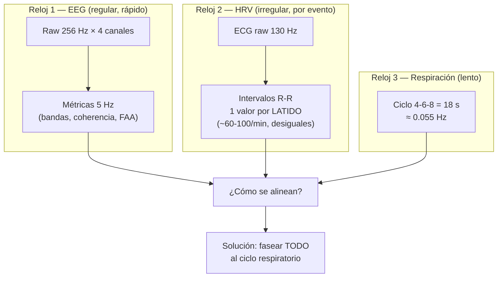
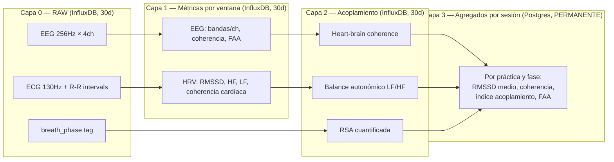
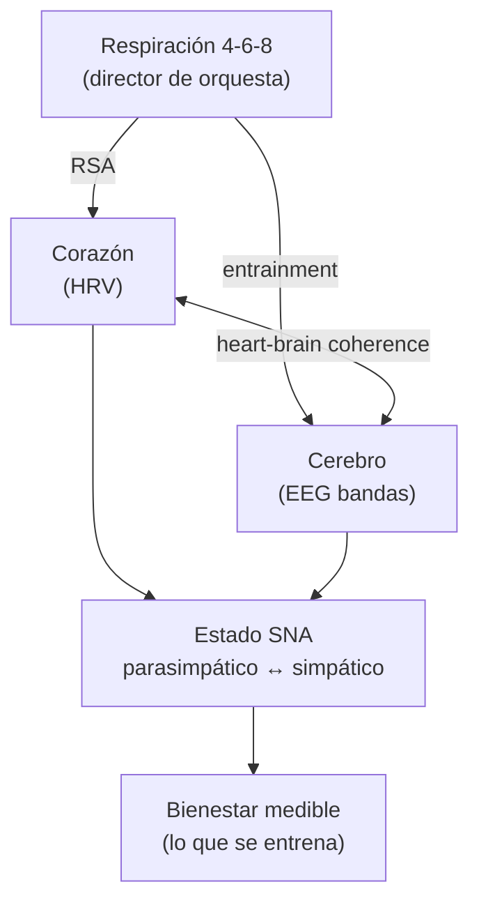
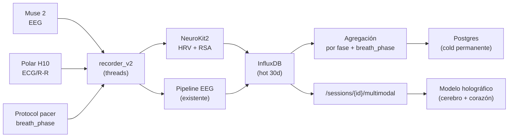
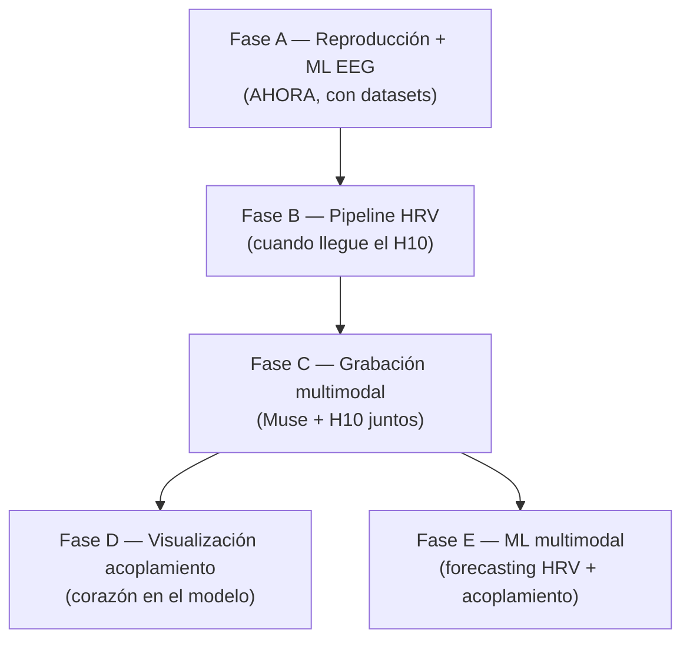

# ADA Multimodal — Modelo de datos y arquitectura

> Paso 1 del salto a multimodal. Documento de planificación, sin código.
> Define qué medimos, cómo lo estructuramos, con qué estándar, y cómo se alinean
> las señales. La fundación sobre la que se construye el ML y la visualización.

---

## 0. El marco honesto (la base de todo)

ADA no mide "energía", "chakras" ni "campos de conciencia". Mide **el efecto
fisiológico de prácticas contemplativas sobre el sistema nervioso**. Cualquier
práctica — meditación, respiración 4-6-8, Reiki, Dispenza, Grinberg, Wim Hof —
se mide bajo el mismo marco neutral: qué le pasa al cerebro, al corazón, y al
acoplamiento entre ambos. Afirmamos el **efecto medible**, no el mecanismo que
la práctica reclama. El dato manda. Esto permite comparar prácticas
objetivamente y es lo que hace el proyecto honesto y publicable.

---

## 1. De unimodal a multimodal

| | Antes (v1) | Ahora (v2 multimodal) |
|---|---|---|
| Órgano | Cerebro | Cerebro + Corazón + (Respiración) |
| Señal | EEG (Muse 2) | EEG + ECG/HRV (Polar H10) + fase respiratoria |
| Foco | Bandas, coherencia inter-hemisférica | + Tono autonómico + acoplamiento corazón-cerebro |
| Pregunta | ¿Qué hace tu cerebro? | ¿Cómo se integra tu sistema nervioso? |

El cerebro deja de ser el sistema; pasa a ser **un nodo** de un sistema
integrado cuyo eje es **cerebro ↔ corazón ↔ respiración ↔ sistema nervioso
autónomo (SNA)**. El SNA es el conector real entre todo lo que el usuario
quiere "entrenar": relajación, regulación emocional, recuperación, foco.

---

## 2. El problema de los tres relojes

Las señales tienen naturalezas temporales **incompatibles**. Forzarlas a una
sola grilla pierde información. Esta es la decisión de arquitectura más
importante del proyecto.



- **EEG**: grilla fija, rápida. Ya resuelto en v1.
- **HRV**: **no es una señal a frecuencia fija** — es una serie de eventos. Un
  valor cada vez que late el corazón. La separación entre latidos (intervalo
  R-R, en milisegundos) **es** el dato; su variabilidad es la HRV.
- **Respiración**: muy lenta. El ciclo 4-6-8 dura 18 s.

---

## 3. El ciclo respiratorio como unidad organizadora

**Propuesta central de diseño.** En vez de forzar todo a una grilla temporal
fija, se fasea cada señal al ciclo de respiración. Razón biológica profunda: la
respiración es el **director de orquesta** del SNA.

- La HRV sube en la **inhalación** y baja en la **exhalación** → esto se llama
  **RSA (Respiratory Sinus Arrhythmia)** y es el mecanismo central que conecta
  respiración y corazón.
- El EEG también se modula con la fase respiratoria (literatura creciente:
  "respiration-entrained brain oscillations").

Faseando al ciclo respiratorio se **revela el acoplamiento** que de otro modo
queda escondido en los promedios. Es el mismo patrón epoch-locked que ya usás
en el ERSP del frontend, pero locked al ciclo respiratorio en vez de a la fase
del protocolo.

### El 4-6-8 como reloj de fase (Decisión 1: por protocolo)

Como la app guía el ritmo, sabemos en qué fase respiratoria está el usuario en
cada segundo, sin sensor de respiración:

```mermaid
gantt
    title Ciclo respiratorio 4-6-8 (18 s) — fases marcadas por protocolo
    dateFormat X
    axisFormat %S s
    section Ciclo
    Inhalación (4s)   :inhale, 0, 4
    Retención (6s)    :hold,   4, 10
    Exhalación (8s)   :exhale, 10, 18
```



Cada ventana de datos (EEG y HRV) se etiqueta con su `breath_phase`
(inhale / hold / exhale) además de la fase del protocolo (`baseline_closed`,
`meditation_free`, etc.). Esto permite preguntas como: *"¿tu alpha sube durante
la retención?"* o *"¿tu HRV pico cae en la exhalación, como predice la RSA?"*

> **Mejora futura (post-H10):** derivar la fase respiratoria del propio ECG
> (la modulación RSA permite reconstruir la respiración del ritmo cardíaco).
> Más preciso, no depende de que el usuario siga la guía perfectamente.
> Por ahora: por protocolo. Suficiente y gratis.

---

## 4. Las cuatro capas de datos

Replica el patrón hot/cold que ya estableciste para EEG (InfluxDB 30d + Postgres
permanente), extendido a multimodal.



### Capa 0 — Raw (InfluxDB, hot 30d)
- **EEG raw**: 256 Hz × 4 canales. *Ya existe.*
- **ECG raw**: 130 Hz del H10 (opcional guardarlo todo) **+ la serie de
  intervalos R-R**, que es lo crítico. El H10 entrega los R-R directo por
  Bluetooth.
- **breath_phase**: tag por timestamp (inhale/hold/exhale), derivado del pacing.

### Capa 1 — Métricas por ventana (InfluxDB, hot 30d)
- **EEG**: bandas per-channel, coherencia, FAA. *Ya existe (Fase 1 completada).*
- **HRV**: ver sección 5 para las métricas exactas y sus ventanas.

### Capa 2 — Acoplamiento (InfluxDB, hot 30d) — *lo innovador*
- Heart-brain coherence, balance autonómico, RSA. Ver sección 6.

### Capa 3 — Agregados por sesión (Postgres, cold permanente)
- Igual que `eeg_recordings` hoy: por práctica y por fase, los agregados que
  sobreviven a los 30 días. **Es lo que permite "demostrar los beneficios"**:
  la evolución de tu coherencia cardíaca a lo largo de 50 sesiones de Dispenza
  vs meditación vs Reiki. Esta capa es la fuente de verdad histórica.

---

## 5. Métricas HRV — definiciones del estándar (NO inventar)

Usamos las definiciones de **Task Force (1996)** y **Shaffer & Ginsberg (2017)**,
los estándares de referencia. Así los números son comparables con la literatura
y publicables. Implementación recomendada: **NeuroKit2** (Python, procesa
EEG+ECG+HRV+respiración con API unificado e implementa estos estándares — encaja
con tu stack FastAPI/Python).

### Dominio temporal

| Métrica | Qué mide | Ventana mínima | Lectura |
|---|---|---|---|
| **RMSSD** | Tono vagal/parasimpático (la reina) | 30-60 s | ↑ = relajación, descanso, recuperación |
| **SDNN** | Variabilidad global | 60 s+ | Índice general de adaptabilidad |
| **pNN50** | % de intervalos que difieren >50ms | 60 s+ | Correlaciona con RMSSD |
| **HR instantáneo** | Frecuencia latido a latido | por latido | Para ver modulación respiratoria (RSA) |

### Dominio frecuencial

| Banda | Rango | Refleja |
|---|---|---|
| **HF** (High Frequency) | 0.15–0.40 Hz | Parasimpático / respiratorio (RSA) |
| **LF** (Low Frequency) | 0.04–0.15 Hz | Mezcla simpático+parasimpático, barorreflejo |
| **LF/HF ratio** | — | Índice (debatido) de balance autonómico |

### Coherencia cardíaca (base fisiológica real, sin el marketing)

Cuando se respira a ~6 resp/min (resonancia, ~0.1 Hz), la HRV entra en un patrón
sinusoidal suave y corazón/respiración/presión se sincronizan. **Métrica:**
cuánta potencia del espectro de HRV se concentra alrededor de 0.1 Hz.

> **Nota sobre el 4-6-8:** ciclo de 18 s = 3.33 resp/min ≈ 0.055 Hz. Está por
> **debajo** del punto resonante clásico (~6 resp/min = 0.1 Hz). Interesante de
> verificar empíricamente: puede que tu 4-6-8 maximice tono vagal (exhalación
> larga) más que coherencia resonante. Un protocolo alternativo de ~5.5 resp/min
> (ej. 4 inhale / 6 exhale sin retención) caería justo en resonancia. **Esto es
> un experimento comparable que ADA podría mostrar:** 4-6-8 vs respiración
> resonante, firma fisiológica de cada uno. Dato, no opinión.

---

## 6. Acoplamiento cerebro-corazón — el territorio innovador

Esto es lo que casi nadie muestra en consumer-grade y donde ADA puede descubrir
algo. Tres índices:

### 6.1 Heart-brain coherence
Phase-locking o correlación entre las oscilaciones de HRV (~0.1 Hz) y la
envolvente de las bandas EEG (especialmente alpha y theta). Pregunta:
*¿tu alpha sube en sincronía con tu HRV durante la meditación?*

### 6.2 Balance autonómico
LF/HF como índice simpático↔parasimpático en el tiempo. Permite ver la
transición a dominancia parasimpática durante una práctica.

### 6.3 RSA cuantificada (respiración → corazón)
La amplitud de la modulación del HR por la respiración. Faseado al ciclo 4-6-8:
cuánto sube el HR en inhalación y baja en exhalación. Es la medida directa del
tono vagal dinámico.



---

## 7. Estándar de representación

No inventar el formato. Apoyarse en convenciones establecidas:

- **HRV**: definiciones de **Task Force 1996** + **Shaffer & Ginsberg 2017**.
- **Procesamiento**: **NeuroKit2** (Python) — unifica EEG, ECG, HRV, RSP, EDA.
  Implementa los estándares, tiene detección de R-peaks robusta, y calcula todas
  las métricas de arriba. Es la pieza que reemplaza tener que escribir el
  pipeline de HRV desde cero.
- **Estructura de archivos** (norte futuro, no para empezar): **BIDS** (Brain
  Imaging Data Structure) tiene extensión para datos fisiológicos
  (`_physio.tsv.gz`). Si algún día querés publicar o compartir, esta es la forma.
- **Validación de R-peaks**: CardioPy o el PhysioNet Cardiovascular Signal
  Toolbox como referencia cruzada.

---

## 8. Esquema concreto de storage

Extiende el patrón actual. Measurements nuevos en InfluxDB, columnas nuevas en
Postgres.

### InfluxDB — measurements nuevos

```
measurement: ecg_rr                      # Capa 0 — la serie de intervalos
tags:    recording_id, breath_phase
fields:  rr_ms (intervalo R-R en ms), hr_instant (bpm)
timestamp: momento del latido (absoluto)

measurement: hrv_metrics                 # Capa 1 — HRV por ventana
tags:    recording_id, protocol_phase, breath_phase
fields:  rmssd, sdnn, pnn50, hf_power, lf_power, lf_hf_ratio, cardiac_coherence
timestamp: fin de ventana

measurement: coupling_metrics            # Capa 2 — acoplamiento
tags:    recording_id, protocol_phase
fields:  heart_brain_coherence, rsa_amplitude, autonomic_balance
timestamp: fin de ventana
```

El EEG existente (`eeg_metrics`, `eeg_band_power`) gana un tag opcional
`breath_phase` para poder fasear al ciclo respiratorio.

### Postgres — columnas nuevas en `eeg_recordings` (o tabla `session_aggregates`)

```sql
-- HRV agregados por sesión (permanentes)
rmssd_mean, rmssd_meditation, sdnn_mean,
hf_power_mean, lf_hf_ratio_mean,
cardiac_coherence_mean, cardiac_coherence_peak,
-- Acoplamiento agregado
heart_brain_coherence_mean,
rsa_amplitude_mean,
-- Versión de schema multimodal
multimodal_version  -- 0=solo EEG, 1=EEG+HRV
```

Mismo principio que `per_channel_version`: distingue sesiones solo-EEG (las
actuales y los datasets) de sesiones multimodales (post-H10).

---

## 9. Pipeline de procesamiento



El H10 se lee en un thread paralelo al del Muse (mismo patrón que ya tenés),
escribe `ecg_rr` a Influx. NeuroKit2 computa HRV por ventana. Todo se fasea al
`breath_phase` que viene del pacer del protocolo.

---

## 10. Roadmap de implementación



**Fase A — ahora, sin hardware:**
- Cargar datasets EEG (ds001787 Brandmeyer, Himalayan yogis, monjes Amaravati).
- Construir clasificación de estados EEG + forecasting de trayectoria de bandas
  (escalones 1 y 2 del ML, dimensión cerebral).
- Construir el pipeline de HRV contra **WESAD** (multimodal con ECG) para tenerlo
  listo y validado antes de que llegue el H10.

**Fase B — pipeline HRV (llega el H10):**
- Lectura BLE del Polar H10 (R-R intervals), thread paralelo.
- NeuroKit2 para métricas HRV. Escritura a `ecg_rr` + `hrv_metrics`.

**Fase C — grabación multimodal:**
- Sesión Muse + H10 simultáneos. Tu 4-6-8 medido en cerebro Y corazón.
- Primer dato de acoplamiento real.

**Fase D — visualización:**
- Modelo anatómico del corazón en el holográfico, latiendo con HRV real.
- Conexión cerebro-corazón visible cuando hay coherencia.

**Fase E — ML multimodal:**
- Con N sesiones: forecasting de HRV, predicción de transición de estado,
  predicción de trayectoria ("si mantenés este ritmo, alcanzás coherencia pico
  en ~40s").

---

## 11. Datasets de referencia (Fase A)

| Dataset | Contenido | Modalidad | Uso |
|---|---|---|---|
| **ds001787** (Brandmeyer & Delorme 2018) | 12 expertos + 12 novicios, mind-wandering | EEG 64ch | Ya citado en tu frontend; clasificación experto/novicio |
| **Himalayan Yoga** (Rishikesh) | 24 meditadores + 12 controles | EEG 64ch | Experto vs novicio vs control |
| **Monjes Amaravati/Santacittarama** | Monjes Theravada, FAM/OMM/LKM | EEG | Shamatha/Vipassana/Metta — match con tu protocolo |
| **WESAD** | Estrés/relajación, wearable | ECG+EDA+otros | Banco de pruebas del pipeline HRV |

**No disponibles públicamente:** Grinberg, Dispenza, Wim Hof (hay estudios pero
no datasets descargables). Esas prácticas se graban con tu propio setup.

---

## 12. Decisiones tomadas

- **Fase respiratoria: por protocolo** (la app pacea el 4-6-8, etiqueta cada
  ventana). Mejora futura: derivar del ECG vía RSA.
- **Sensor: Polar H10** (ECG real, R-R precisos, Bluetooth abierto, ~90€).
- **Procesamiento HRV: NeuroKit2** (estándar, Python, encaja con el stack).
- **Storage: extiende hot/cold** (Influx 30d + Postgres permanente), mismo
  patrón que el EEG per-channel ya validado.
- **Orden: datasets/ML-EEG primero**, HRV cuando llegue el H10.

---

## Referencias de estándares

- Task Force of ESC/NASPE (1996). Heart rate variability: standards of
  measurement, physiological interpretation, and clinical use. *Circulation*.
- Shaffer, F., & Ginsberg, J.P. (2017). An overview of heart rate variability
  metrics and norms. *Frontiers in Public Health*.
- NeuroKit2: Makowski et al. (2021). *Behavior Research Methods*.
- Brandmeyer, T., & Delorme, A. (2018). [ds001787]. *Frontiers in Human Neuroscience*.
- Lehrer, P., & Gevirtz, R. (2014). Heart rate variability biofeedback: how and
  why does it work? *Frontiers in Psychology*. (coherencia resonante)
- BIDS Physiological data extension. bids-specification.readthedocs.io